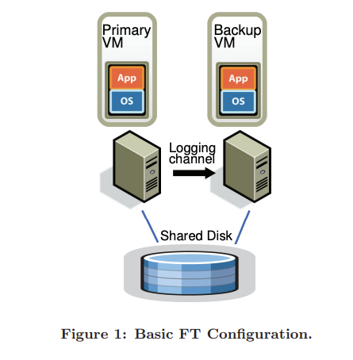
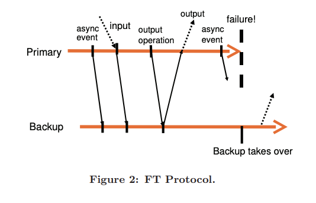
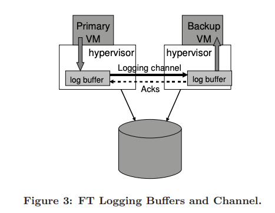
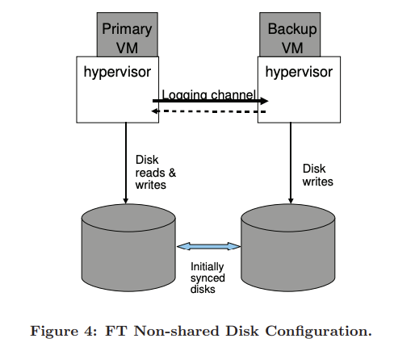

# paper: https://pdos.csail.mit.edu/6.824/papers/vm-ft.pdf

## Abstract

Fault-tolerant VMs through ```replicating execution of primary VM via backup VM on another server```. Reduces performance of real apps by < 10% apparently, and data bandwidth for both primary & backup < 20 Mbit/s (allows for implementing fault-tolerance over longer distances). Point is to automatically restore redundancy after failure (which requires more components than just some replicated VM execution)

## Intro

Common Approach to impl fault-tolerant server: Primary/Backup Approach
```
backup server always available to take over if primary fails
Backup server STATE is NEARLY IDENTICAL to primary server at all times (ready to takeover anytime)
Pro: Client would never know about failure
Con: Requires replicating all state of primary (CPU,mem,IO) to backup CONTINUOUSLY -> INSANE BANDWIDTH COST TO COPY ENTIRE STATE
```

2nd Approach for fault-tolerant server (Less bandwidth use): State Machine Approach (good for VMs, bad for physical machines)
```
Servers = deterministic state machine 
Kept in sync by starting at same init state, then feed same exact input and order
Non-deterministic operations require extra coordination to make sure primary/backup have same thing (HARD)

-> coordination is hard when CPU freq increases (its so fast and parallel, trying to have same execution order is hard, its usually unpredictable)

Hypervisor = virtualization software that creates/runs multiple VM on 1 computer, by allowing shared resources (CPU/MEM, etc) while staying isolated, it has total control of all instructions going into these VMs, it sits in front of the VMs and manages their allocation/resources and traffic

-> VM on top of a hypervisor = easier for state machine approach (because hypervisor CONTROLS all instructions VM sees and can record all operations/things occurring in primary) -> hypervisor records and send hard to coordinate non-deterministic operations to backup to be replayed correctly

Because of the low bandwidth requirement we can have the VMs for primary/backup run on machines even farther away from each other

VMware vSphere FT uses this
Deterministic replay: the base technology they used to record execution of a primary and making sure backup executes it identically
Adds on ability for automatic restores for redundancy after failure by starting new backup VM on top of the hardware fault tolerance
```

In multi-processor VM every access to some shared memory can be non-deterministic, super inefficient to record/replay


## Basic Fault Tolerant Design


Primary and Backup VM exist in separate physical machines (in sync & executes identical operations but with small time lag, this is called ```virtual lock-step```)

Virtual disk for both VM are on shared storage -> accessible to both primary/backup for input/output

1) Primary VM advertises itself to network so all net inputs come to primary VM
2) Input received by primary VM (and some additional info for non-deterministic in 2.1) -> backup VM via net connection (logging channel). Note: net/disk is the dominant input traffic
3) Backup VM executes identically to primary VM but hypervisor drops its output and only keeps primary output (primary/backup agree to protocol so no data is lost if primary fails)
4) Heartbeat mechanism for failure detection of both primary/backup + monitoring of traffic in logging channel
5) Must make sure only primary OR backup takes over in casse of network partition/lost communication

### 2.1 Deterministic Replay Impl (Ensures primary/backup in sync via logging channel)
3 main challenges
1) correctly capturing all input & non-determinism for deterministic execution of backup
2) correctly USING inputs & non-determinism to backup
3) making sure no performance drops while satisfying the previous 2 points
Note: x86 microprocessors have undefeined side effects so its hard to replay those too

How VM Deterministic Replay does it:
1) records input/non-determinism execution -> stream of log entries written to logfile
2) Backup VM reads log entries in logfile to replay (non-deterministic has proper extra info in logs to replay same output)
(Efficiently records and deliver events using hardware features: performance counters)

### 2.2 FT Protocol
Log entries -> backup VM via logging channel rather than writing to disk

Requirement for log entries to guarantee FT:
```
if backup VM takes over a failed primary, backup VM must continue executing so it's 100% consistent with all outputs that primary VM has sent to external world.
^ guarantees that backup VM will still execute like primary VM even after takeover even with all the non-deterministic events, clients will NOT NOTICE the difference
```

Before primary sends any output (network packet), it must give all of its log entries up to this output point to the backup, so backup can follow to this exact point and then send an ACK back. Backup needs to know this is when the output occurs so if primary fails, backup is ready to take over.

^ Done by creating a special log entry at each output operation. So a new rule would be the ```Output Rule:```
```
primary VM cannot send output to external world (must wait, not stopped) until backup VM received and ACK log entries up to the operation producing output
```


Timeline of events from prinary to backup line, can see that all log entries sent to backup until output, then backup ACKs all of them. When primary fails, backup takes over in a state consistent with primary's last output

Outputs not guaranteed to only show up once when failover (no way backup knows if primary crash before sending output or after), needs ```Transactions 2-phase commit```

TCP handles lost & dup packets (lost packets from sending primary while it's dying, but can be a bunch of other reasons too,  so infra/os/app must be written to compensate)

### 2.3 Detecting/Responding to Failure
Primary < -- > Backup 

Both takeovers if each other fails, but backup takeover can have ```lag``` cause it can ACK logs but not have executed up to primary's point yet. Must execute all logs then stop ```replay mode -> normal mode as the new primary and send outputs to external world``` 

```To transition it must first:``` 
1) Must broadcast/advertise the MAC Address of the physical host of the new Backup/New Primary (VM lives over here now)
2) Disk I/O need to be retried (some disk operation might have started but not completed, the backup has to actually perform disk writes that the old primary tried since before all outputs from backup are dropped)

```Detecting Failures:```
1) UDP heartbeating btwn servers on FT VMs to detect when server may have crashed
2) Monitoring logging traffic primary <--> backup, if there's a halt in log entries or ACKs

If either of these has stopped more than a specific timeout time, we know it's a real failure

```Slight issue with detecting failures:```
1) But this issue can just be a network partition, just cause backup doesn't get heartbeat from primary, doesn't mean it failed, just that they can't communicate. 
2) This can cause issues since backup goes live, and now both primary & backup are live, so prob data corruption and problem for clients. 
3) To avoid this, use ```shared storage``` to store virtual disks of VM
    - if primary/backup Vm wants to go live, ```exec atomic test-and-set lock operation on shared storage -> success = VM can go live -> fail = other VM is already live so curr VM halts (Essentially only 1 VM can hold the lock which is the VM that is the primary)
    - if cannot access shared storage -> just wait until possible -> if storage network issue then VM cannot do useful work anyway since ```virtual disk at same shared storage``` so no extra unavailability

```When a new VM goes live, automatically creates a new backup VM on another physical host to restore redundancy, to maintain fault-tolerant VMs```

## Practical Impl of Fault Tolerance
There are additional components to be designed/implemented on top of those design and protocols for FT

### 3.1 Starting/Restarting FT VMs
Need to start a backup VM in same state as primary VM (at any state that primary VM is in):
- necessary for if backup VM dies and needs to be restarted

It does this by cloning a VM to a remote host rather than migrate, and also sets up logging channel, and makes the primary VM enter logging mode as primary and destination to this new backup created (this only halts the execution of primary VM by < 1 second)

Need to also choose a server to run backup VM:
- FT VMs run in cluster of servers that access a shared storage, all VMs usually can run on any server in a cluster
- Clustering service maintains management and resource info
- If failure occurs where primary VM needs a new backup, just tell the clustering service which finds the best server to run backup VM based on resource usage and other requirements, and then creates it.
- Redundancy usually restored within minutes of server failure without any noticable change

### 3.2 Managing Logging Channel

- Hypervisor maintains large buffer for both priamry & backup
- primary executes stuff and immediate creates log entries in own log buffer
- backup consumes log entries from its own log buffer
- primary buffer flushes out to logging channel ASAP, backup reads its own buffer ASAP then sends ACK
- ACK allows primary to then finally send output
- backup VM just stops execution and waits for next log entry is available if buffer empty
- primary VM stops execution if log buffer full, waits for it to flush it out (impl is done so log entries are never generated too fast and log buffer will never be filled up to actually stop execution and affect clients)
- reasons why log buffer full: 1. log entries written too fast 2. backup VM executing too slowly so its consuming log entries too slowly (overhead of recording/replaying usually == so should be no problem, but if backup is sharing resources with other VMs and is allocating little resources to backup (CPU/mem))
- also bad if log buffer full since if primary VM dies, backup VM must replay ALL those log entries it has ACKed before going live (which can be long)
- execution lag time should be < 1 second
- Mechanism: slow down primary VM by sending additional info to find real-time exec lag btwn primary & backup VM (usually < 100ms). If backup VM has significant exec lag (>1 sec), slow down the primary VM by giving less CPU resources. (It probes for the proper amount of CPU resources to match primary == backup speed)


### 3.3 Operation on FT VMs
things like shutting down a primary VM, changing resource management should also apply to backup VM, once again we use the ```logging channel, sending special control entries to apply the same operations to the backup```

Only exception: moving a FT VM (called VMotion)
- usually it does 1. finish all disk I/O thats occurring rn, 2. migrate VM once everything is quiet/complete
- but has backup which replays EVERYTHING primary does, backup isn't doing REAL disk IO, its just simulating what priamry does (so there's no waiting for all IO to finish)
- how this is solved is: send msg in logging channel -> force primary VM to temporarily pause disk IO -> backup catches up -> backup resumes replay (now both sync'd and backup can become primary) -> after switchover there could be IO operation that never went to disk (backup didn't write to disk) -> guest OS may expect a disk response so fault tolerance re-issues pending disk IO to be reran again on new primary even if it "already happened"


### 3.4 Impl Issues for Disk IO
Problems: 
1) disk operations are ```non-blocking``` -> execute in parallel -> simultaneous disk operations that access same disk loc -> NON-DETERMINISM
    - Solution: Detect IO race conditions, force it to execute SEQUENTIALLY in same way on primary & backup to make it DETERMINISTIC
2) Disk uses ```DMA (Direct Memory Access)``` so disk reads/writes to VM memory directly and the guest OS or app may also access same memory = race condition
    - Bad Solution: page protection temporarily on pages that are used by disk operations. Bad because if VM tries to access that part of disk, it's paused until disk operation is done, so it degrades performance, and changing MMU protection on pages is expensive too
    - Solution: ```bounce buffers``` -> temporary buffer same size as memory being accessed by disk operation
        - disk read data -> bounce buffer, only when IO done, data copied into VM memory
        - disk write data -> copies VM memory to buffer first -> writes from bounce buffer not VM memory
        - guarantees memory never accessed concurrenctly by disk DMA and CPU, and now ordering is DETERMINISTIC
        - disk overhead operations may slow it down, but never noticable
3) disk IO outstanding (not completed) on primary when failure occurs and backup takes over
    - backup doesn't know if disk IOs were issued to disk on primary or if it was even completed by primary
    - guest OS expects complete notifs, and can't just say IO failed since OSes don't respond well to disk errors & unnecessary crashes & resets may occur
    - Solution: VMware tracks pending disk IOs, when "go live" for backup, ```re-issue those disk IOs``` even if it is already completed earlier because
        1) disk IOs are idempotent (1 vs 1+ operation of it = same result)
        2) specified directly which memory/disk blocks are accessed
        3) because of our previous 2 solutions, we don't have any race conditions


### 3.5 Impl Issues for Network IO
Hypervisor can asynchronously update state of VM's network device but this is non-deterministic, so no guarantee that operations happen at the same exact time and order on primary & backup

Need to disable async network optimizations (e.g. NIC (network card) updating buffer asynchronously, interrupts at random times)

Solution to make it deterministic:

Hypervisor stores incoming packets and delays delivery until it can inject same exact instructions on both VMs, so rather than packets -> memory, ```traps event -> logs it -> replay deterministically on backup```

Optimization to Network Slowdown (cause of Output Rule and disabled network optimizations):
1) ```Packet Clustering```: reduces VM traps & interrupts by grouping packets, this way only 1 interrupt per group, if traffic is high then it could even be 0 interrupt, (less CPU overhead)
2) ```Fast ACK + Batched Logging Channel```: reduce time required to send log message to backup and getting an ACK back WITHOUT thread context switch (send and ACK within same context switch), ACK acknowledges a batched amount of packets being sent to the backup (so multiple log entries are ACKed by the same ACK)

## Design Alternatives

### Shared vs. Non-shared Disk

Shared: 
- guaranteed to have correct content in shared disk if failover occurs
- writes only come from primary VM but needs to be delayed to follow Output Rule
- disk is basically considered part of the "external world"

Non-Shared:
- backup writes to own virtual disk, tries to keep in sync with content of primary VM's own virtual disk
- figure 4 shows how it's doing it 
- disk writes of primary don't need to be delayed anymore
- shared storage can be too expensive or machines of primary & backup are way too far apart
- Disadvantage: 
    - two copies of virtual disk has to be synced up when FT enabled
    - disk can de-sync due to a failure, so need to re-sync after failed VM restarted. 
    - not only sync running state, but disk state is very annoying
    - no shared storage for network partitions/communication issue, so need to have some external tie-breaker that both servers can talk to (confusing to know who to "go live" and be primary)
        - if > 2 nodes: can use majority algo where it decides "go live" by whichever server is part of a cluster that includes most of the original nodes

### Executing Disk Reads on Backup VM
In default design, backup VM never reads from virtual disk (whether shared or non-shared) since its just fed through the logging channel, the primary disk does the reading of disk (inputs)

Another design is to. have backup VM execute disk reads -> no more logging disk read data -> less logging channel traffic
- However, it slows down backup VM execution since it has to execute disk reads + wait if not physically completed on primary as well (can't be ahead!)
- if failed disk read, must be retried until it succeed (both primary and backup can fail), if disk read by primary fails then it must be sent to backup (since we want backup to have same failure then)
- if we used this with shared mem, a disk read + disk write by primary VM, the disk write must be delayed so backup VM can disk read first, otherwise the read may not be ```deterministic```, this can be handled but is an extra complexity
- ```Performance: (1-4%) decrease in throughput but reduced logging bandwidth noticably```

## Performance Evaluation
- FT performance overhead is minimal, and able to support fault-tolerant VMs, < 5% difference from non-FT VM
- bandwidth usage isn't too bad either, only dominated by disk and network inputs sent to backup, logging channel could end up being a bottleneck if we need to use logging channel for other purposes as well but generally logging channel is low bandwidth so replay-based FT is very attractive for long-distance configuration using non-shared disks. 
- Should use disk-read on backup if we have limited bandwidth for logging channel (but at the cost of throughput), otherwise should keep it on primary VM 

Network Benchmarks:
- high-speed networking = high interrupt rate = more logging/replaying async events at high rate
- benchmark that receive high rate of packets = high rate logging traffic needed to send to backup via logging channel
- bencmark send packets -> all part of OUTPUT RULE = delay sending network packets until properly ACKed by backup = HIGHER LATENCY to client (and decrease net bandwidth to client since protocols (e.g. TCP) can have inputs & non-deterministic operations on logging channels)
- generally < 10% overhead & < 20 Mbit/s bandwidth required btwn primary & backup hosts

## Conclusions
- FT for VMs on servers in a cluster
- Design = replicating execution of primary VM via backup VM on another physical host using ```Deterministic Replay```
- If primary fails, backup VM takes over immediately with no loss of dat or interruption
- Performance = Excellent (< 10% overhead), most of overhead comes from Deterministic Replay to keep primary and backup VMs in sync
- Logging bandwidth required for primary < sync > Backup < 20 Mbit/s, it is very feasible to have primary and backup VMs to be very far from each other (1-100 km good for if an entire area fails)
- Can compress log streams so logging bandwidth can be decreased a lot with small CPU overhead
- Need to also implement other QoL features like automatic restore redundancy, etc.
- only really good for uni-processor VMs so just use a lot fo them together, could look into how to make it useful with multi-processor
- Also look into how to be able to detect partial hardware issues that isn't exactly ruining the primary but decrease it enough that we'd rather have backup "go live"
- Good way to prevent split-brain or servers thinking they are primary after network/communication loss is basically not having the backup ACK the primary, so it never spits its output out since its a requirement by Output Rule