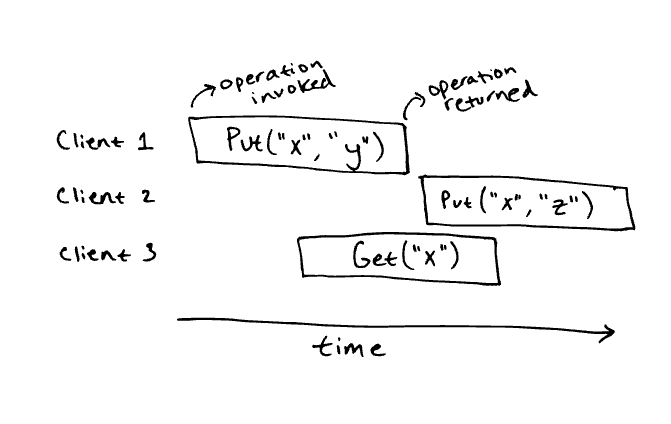
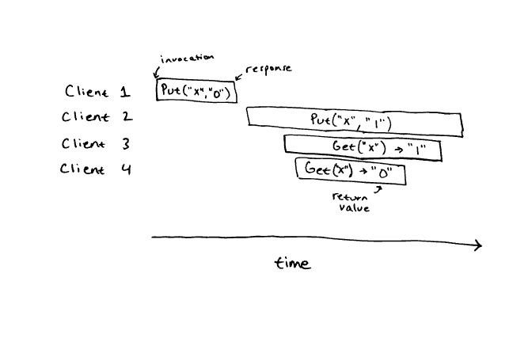
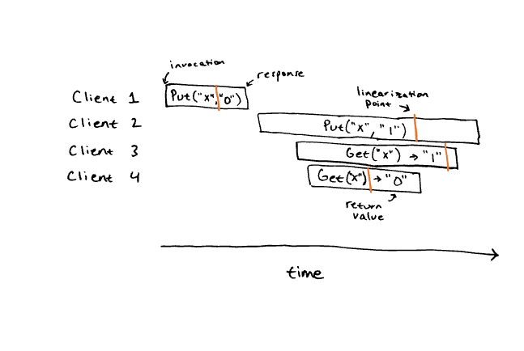
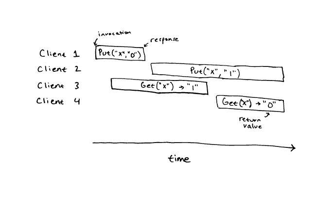

# Paper on Linearizability: https://anishathalye.com/testing-distributed-systems-for-linearizability/

Implementation is hard because concurrency & failure requires careful handling.
- Networks can delay, dup, reorder, drop packets, and machines can fial anytime
- Coding is not easy, there can be subtle errors that you will never find out because the cases are super rare to occur and test (e.g. simultaneous machine failure or EXTREME network delay)

## Correctness
Correctness: is the behavior right and intended?

Example:
```
Simple Key-Value Store (string to string mapping)
Put(key, value)
Get(key)

Need to see it as a SEQUENTIAL CASE first

Put("x","y")
Get("x") #should return "y" not "z"

class KVStore:
    def __init__(self):
        self._data = {}

    def put(self, key, value):
        self._data[key] = value

    def get(self, key):
        return self._data.get(key, "")
^
start state (self._data = {})
how internal state is modified as a result of put
values returned as a result of get calls
```

Now look at it from a CONCURRENT operation

Linearizability:  


Not obvious if Get("x") is supposed to return ```"y"```, ```"z"```, or ```""```

```Linearizability```: a strong consistency model that specifies correctness for concurrent operations based on sequential specifications (can we explain the results as if it were to be ran sequentially?)

Essentially, every operation appears to execute atomically and isntantanteously at some point btwn the invocation and response. 

Most distributed system provides linearizable behavior, and many other systems build ontop of this linearizable systems

Example:



History is ```linearizable``` shown by picture below, linearization points for all operations are in orange. Essentially the sequential history is ```Put("x", "0"), Get("x") -> "0", Put("x", "1"), Get("x") -> "1"```


The one below is not linearizable because there is no way we can somehow explain in a linear fashion, how the ```1. Get("x") -> "1"``` turned into ```2. Get("x") -> "0"``` when Put 0 is obviously before Put 1, so there's no way 0 should ever be returned after a 1 for Get, this cannot be explained linearly.

The only combo we can assign points to are ```1,2,4 (Put 0 -> Put 1 -> Get 1)``` and ```1,2,3 (Put 0 -> Get 0 -> Put (1))```. There is no way to fit the last client in either case (otherwise it doesn't make sense to read a stale value), so it is not linearizable.

Not linearizable (can't assign all points properly so it fails either real-time requirement and/or value-consistency requirement, linearizability also disallows duplicate requests cause it means u can have a |-------Wx1--------| have 2 linearization points which doesn't follow the requirement.)



## Testing
Can test by checking for correct operations while under random injections of faults at random times (e.g. machine failure, network partitions, extreme long network delays), and repeat this a bunch of times to cover a bunch of randomness.

```Ad-hoc testing```: Can test in a way like 
```
for client_id = 0..10 {
    spawn thread {
        for i = 0..1000 {
            value = rand()
            kvstore.put(client_id, value)
            assert(kvstore.get(client_id) == value)
        }
    }
}
wait for threads
```

If this fails, we clearly know it's not linearizable but this test itself doesn't guarantee linearizability.

```Linearizability Better Testing```: Ideally we want to test using totally random operations done concurrently by many clients calling the method ```kvstore.put(rand(), rand()) and kvstore.get(rand())```. And usually we want the rand() to cover a small set of keys so their collision rate is high, so the puts and gets are a lot more interesting, rather than having each client have its own key and only updating its own value without other client's interference.

What we do when we have collision is actually copy the entire history of operations (operation, request send time, respond when), this way we can actually try to see if the history is ```linearizable``` into a sequential way.

```Linearizability Checking```: takes input sequential specification (facts) and concurrent history, and it checks whether the history is linearizable with respect the specification and real-time behavior by testing all the different orderings of events to see if it satisfies the spec.

Linearizability is NP-Complete, basically it is way too hard solve for large problems since NP-Complete means the problem with expanding input sizes increases in exponential time to solve. It makes sense since if you add 1 more operation to a 50 operation history, you now have 51! ways of ordering rather than 50! (factorial is worse than exponential). Using a linearizability test however, is still a lot better than ad-hoc tests since it actually catches the more subtle bugs that ad-hoc tests cannot.

